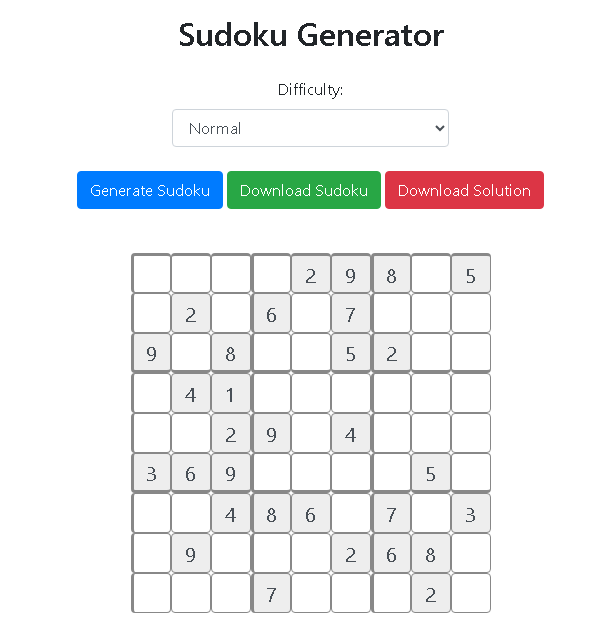

# Sudoku Generator – Online Tool

[👉 **Live Demo – Try Now**](https://online-tools.muisca.co/en/tools/generators/sodoku-generator)

---

## 🧩 Sudoku Generator (Client-Side, Bootstrap 4.4.1 + JavaScript)

**Sudoku Generator** is a free, fully client-side tool that creates Sudoku puzzles in five difficulty levels: *Very Easy, Easy, Normal, Hard,* and *Expert*.  
It includes an interactive solver, mistake highlighting, and the ability to download both the puzzle and its solution as clean, high-quality images.

---

## 📸 Screenshots

> Example:  
  

---

## 🚀 Features

- Generate Sudoku puzzles instantly (all client-side).
- Five difficulty levels for beginners and experts.
- Interactive grid with:
  - Number entry  
  - Real-time validation  
  - Highlighting incorrect inputs  
- Download puzzle and solution as PNG images.
- No registration, no backend, no tracking.
- 100% free and unlimited use.

---

## 🛠 Technical Details

This tool is built using:

- **Bootstrap 4.4.1** for interface layout and responsive styling.  
- **Vanilla JavaScript** for:
  - Backtracking Sudoku puzzle generator  
  - Sudoku solver  
  - Difficulty adjustment algorithm  
  - Canvas-based PNG export  
- **HTML/CSS** for grid rendering and user interaction.

All puzzle generation and solving happen on the client, ensuring **speed, privacy, and zero server load**.

